# PawPal+ — Final UML Class Diagram (Mermaid source)

```mermaid
classDiagram
    class Task {
        «dataclass»
        +name : str
        +category : str
        +duration_minutes : int
        +priority : str
        +preferred_time_of_day : str
        +frequency_per_day : int
        +notes : str
        +completed : bool
        +recurrence : str | None
        +due_date : date | None
        +is_high_priority() bool
        +get_priority_score() int
        +mark_complete() None
        +next_occurrence() Task | None
    }

    class Pet {
        «dataclass»
        +name : str
        +species : str
        +breed : str
        +age_years : int
        +weight_lbs : float
        +health_conditions : list[str]
        +tasks : list[Task]
        +add_task(task) None
        +remove_task(task_name) None
        +get_pending_tasks() list[Task]
        +get_care_requirements() list[Task]
        +update_health_info(condition) None
    }

    class Owner {
        +name : str
        +available_minutes : int
        +preferred_times : list[str]
        +energy_level : str
        +preferences : dict
        +pets : list[Pet]
        +add_pet(pet) None
        +remove_pet(pet_name) None
        +get_all_tasks() list[tuple]
        +get_pending_tasks() list[tuple]
        +add_constraint(key, value) None
        +update_preferences(key, value) None
        +get_available_slots() list[str]
    }

    class Scheduler {
        +owner : Owner
        +date : str
        +scheduled : list[dict]
        +skipped : list[dict]
        -_time_used : int
        $TIME_ORDER : list[str]
        -_collect_tasks() list[tuple]
        -_rank_tasks(tasks) list[tuple]
        -_assign_slot(task) str
        +generate_plan() None
        +detect_conflicts() list[str]
        +sort_by_time() list[dict]
        +filter_tasks(completed, pet_name) list[dict]
        +mark_task_done(task_name) bool
        +get_summary() dict
        +explain_plan() str
    }

    Pet "1" *-- "*" Task : tasks
    Owner "1" *-- "*" Pet : pets
    Scheduler --> Owner : uses
```

## What changed from the initial design

| Initial design | Final implementation |
|---|---|
| Called "Daily Plan" | Renamed to **Scheduler** |
| No conflict detection | Added `detect_conflicts()` |
| No sort/filter methods | Added `sort_by_time()` and `filter_tasks()` |
| No recurrence support | Task has `next_occurrence()` + `mark_task_done()` auto-chains |
| No priority scoring | Task has `get_priority_score()` used by `_rank_tasks()` |
| Owner not connected to Scheduler | Scheduler holds `Owner` reference; accesses pets/tasks through it |
